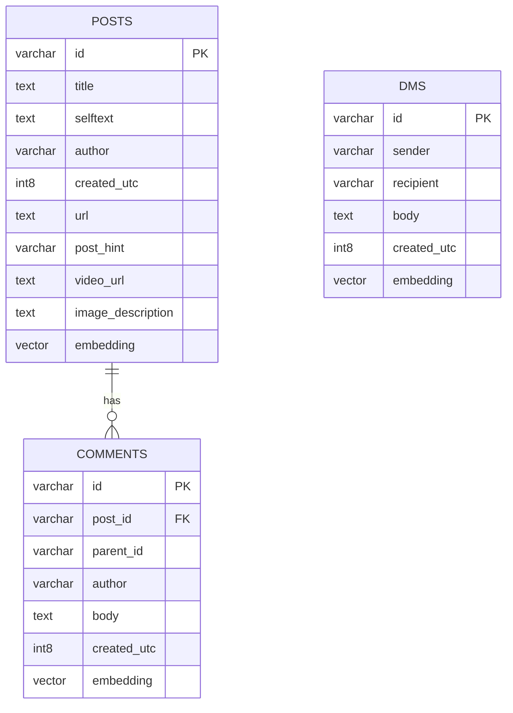

<h1 align="center">
   
  
   
  AskNITJ
   
</h1>

<h4 align="center">u/AskNITJ is a reddit bot designed specifically to help students on r/NITJalandhar</h4>

  
  
  
  

---

## How does AskNITJ work?

- Uses [Reddit API](https://www.reddit.com/dev/api/) (via [reddit](https://www.npmjs.com/package/reddit)) to fetch posts, comments & inbox messages.
- Stores posts, comments & direct messages in a PostgreSQL database.
- **Embedding Pipeline:** Converts text elements using the `nvidia/llama-nemotron-embed-1b-v2` model. The output embeddings are dynamically sliced to **1024 dimensions** (via Matryoshka Representation Learning) and **L2-normalized** to optimize pgvector search efficiency.
- **SHA-256 Wiki Cache**: Pre-computes and caches wiki static files (`assets/redditPosts/`) on startup. It performs SHA-256 change validation to detect modified files, and prunes cache keys for deleted files.
- **VLM Media Descriptions**: Describes images (using `meta/llama-3.2-90b-vision-instruct` / Llama-3.2-11b) and videos (using `qwen/qwen3.5-397b-a17b` / Llama-3.2-11b fallback) in posts and crossposts at storage time or dynamically during RAG context synthesis.
- Uses **Tavily Search API** to fetch live internet comparison data when user queries ask for comparisons or alternative college recommendations.
- Uses **NVIDIA API** (`mistralai/mistral-medium-3.5-128b` / Llama-3.1-70b fallback) to generate answers utilizing matching database results, wiki context, and live internet search data.
- NVIDIA returns an action (`reply | query_user | reply_with_gif | dont_reply`), where the bot can either reply, fetch a user's profile overview context, reply with a Giphy GIF, or skip.

---

## Logging and Production Mode

The bot features a structured, color-coded logging system via the `chalk` library, separating operational concerns visually:
* **`[BOT]`** (Green) — App startup, wiki cache pre-computation, and scheduler.
* **`[DATABASE]`** (Blue) — Table creation, schema migrations, and indexing operations.
* **`[STORE]`** (Green) — Ingest pipeline actions (database inserts and VLM updates).
* **`[REDDIT]`** (Red) — Reddit REST client requests, limits, and composition.
* **`[RAG]`** / **`[RAG Boost]`** / **`[RAG Cache]`** (Cyan) — Dense retriever details, Matryoshka slicing, keyword matches, and wiki hits.
* **`[TAVILY SEARCH]`** / **`[VISION]`** / **`[MEDIA]`** (Yellow) — Search engine interactions, frame extractions, and vision describer pipelines.
* **`[POST]`** / **`[COMMENT]`** / **`[DM]`** (Magenta/Cyan) — Input events, model prompts, and JSON response actions.
* **`[ERROR]`** (Red) — Exceptions, model fallbacks, and schema validation failures.

---

## Recommended Resources:

- [How LLMs work with vector databases](https://stackoverflow.blog/2023/10/09/from-prototype-to-production-vector-databases-in-generative-ai-applications/)
- [Vector Database](https://www.ibm.com/think/topics/vector-database)
- [Cosine similarity](https://www.youtube.com/watch?v=e9U0QAFbfLI&ab_channel=StatQuestwithJoshStarmer)

## Database Structure:

---

## AskNITJ Flowchart for Posts:

```mermaid
---
config:
  layout: dagre
---
flowchart TD
 subgraph s1["newPostProcessor()"]
        n3(["Semantic & keyword search context"])
        n12(["Check comparison intent: Fetch live internet context"])
        n4(["Requests NVIDIA API with post details, relevant DB context & live internet context"])
        n5(["NVIDIA may request user's recent posts/comments for context"])
        n6(["Returns reply action, reply text, or gif search query"])
  end

    A(["Fetch newest 5 posts & 20 comments"]) --> n1(["Check for post ids not in seenPostIds (from database)"])
    n1 -- "Pushes new posts to newPostProcessor([...post])" --> B(["Stores the post in database"])
    B --> s1
    n3 --> n12 --> n4
    n4 --> n5 & n6
    n5 --> n4
    s1 -- "action: reply" --> n7(["Reply to the post using Reddit API"])
    s1 -- "action: reply_with_gif" --> n11(["Query Giphy, evaluate still image embeddings & reply with GIF"])
    s1 -- "action: dont_reply" --> n8(["Ignore post"])
    style s1 fill:#4d4d4d,stroke:#ffffff,stroke-width:1px
```

---

## AskNITJ Flowchart for Comments:

```mermaid
---
config:
  layout: dagre
---
flowchart TD
 subgraph s1["newCommentProcessor()"]
        n3(["Semantic & keyword search context"])
        n12(["Check comparison intent: Fetch live internet context"])
        n4(["Requests NVIDIA API with comment thread, relevant DB context & live internet context"])
        n5(["NVIDIA may request user's recent posts/comments for context"])
        n6(["Returns reply action, reply text, or gif search query"])
  end

    A(["Fetch newest 5 posts & 20 comments"]) --> n1(["Check for comment ids not in seenCommentIds (from database)"])
    n1 -- "Pushes new comments to newCommentProcessor([...comment])" --> B(["Stores the comment in database"])
    B --> n9(["Check: Mentioned u/AskNITJ OR replying to u/AskNITJ OR user is not the bot"])
    n3 --> n12 --> n4
    n4 --> n5 & n6
    n5 --> n4
    s1 -- "action: reply" --> n7(["Reply to the comment using Reddit API"])
    s1 -- "action: reply_with_gif" --> n11(["Query Giphy, evaluate still image embeddings & reply with GIF"])
    s1 -- "action: dont_reply" --> n8(["Ignore comment"])
    n9 -- "Passes validation" --> s1
    n9 --> n8
    style s1 fill:#4d4d4d,stroke:#ffffff,stroke-width:1px
```

---

## AskNITJ Flowchart for DMs:

```mermaid
---
config:
  layout: dagre
---
flowchart TD
 subgraph s1["newDMProcessor()"]
        n3(["Semantic & keyword search context"])
        n12(["Check comparison intent: Fetch live internet context"])
        n4(["Requests NVIDIA API with message, recent chat history, relevant DB context & live internet context"])
        n5(["NVIDIA may request user's recent posts/comments for context"])
        n6(["Returns reply action, reply text, or gif search query"])
  end

    A(["Fetch newest 5 DMs"]) --> n1(["Check for message ids not in seenMessageIds (from database)"])
    n1 --> n10(["Stores the messages in database"])
    n10 --> B(["Fetch recent DM history from database"])
    n3 --> n12 --> n4
    n4 --> n5 & n6
    n5 --> n4
    s1 -- "action: reply" --> n7(["Reply to the message using Reddit API & Save DB"])
    s1 -- "action: reply_with_gif" --> n11(["Query Giphy, evaluate still image embeddings & reply with GIF & Save DB"])
    s1 -- "action: dont_reply" --> n8(["Ignore DM"])
    B -- "Pushes grouped DMs to newDMProcessor([...message])" --> s1
    style s1 fill:#4d4d4d,stroke:#ffffff,stroke-width:1px
```

---

### 🧩 How to Contribute
1. Fork this repository.
2. Pick an open issue.
3. Create your branch and make improvements.
4. Submit a Pull Request (PR).

---

Happy hacking, and thank you for supporting open source ❤️  

  <a href="https://github.com/Opensource-NITJ/AskNITJ/issues">🔗 View Issues</a>

